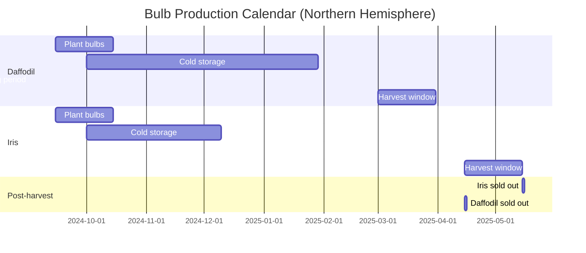

# Cut Flower Bulb Research: Daffodil & Blue Iris Analysis

> **Research Date:** April 26, 2026  
> **Research Scope:** Commercial cut flower bulb viability for Flower Garden Project  
> **Bulbs Investigated:** Narcissus (Daffodil) & Iris hollandica (Dutch Blue Iris)

---

## Executive Summary

| Bulb Type | Overall Rating | Recommendation | Key Strength | Key Weakness |
|-----------|---------------|----------------|--------------|--------------|
| **Daffodil (Narcissus)** | ✅ **Good** | ✅ Recommended | Early spring premium pricing | Toxic sap (separate handling required) |
| **Blue Iris (Dutch)** | ✅ **Excellent** | ✅ **Strongly Recommended** | No toxic sap, mixes safely | Delicate stems, shorter vase life |

**Bottom Line:** Both bulbs are commercially viable. **Blue Iris** offers better integration flexibility (no toxic sap), while **Daffodils** provide longer-term bulb returns (2-3 years). Plant both for season extension and color diversity.

---

## 🌼 Daffodil (Narcissus) Deep Dive

### Botanical Identity
- **Scientific Name:** *Narcissus* spp. (many cultivars)
- **Common Names:** Daffodil, jonquil, paperwhite (depending on type)
- **Type:** Bulbous perennial
- **Note:** "All daffodils are narcissus, but not all narcissus are daffodils" — daffodils specifically refer to large-cupped varieties

---

### Commercial Production Specs

| Metric | Specification |
|--------|---------------|
| **Cold Treatment (Forcing)** | 12–17 weeks at 2–7°C (35–45°F) |
| **Forcing Time After Cold** | 3–4 weeks |
| **Harvest Stage** | "Goose-neck" stage — buds colored, nodding at 45° angle |
| **Stem Length (Commercial)** | 30–45 cm (12–18") typical; some varieties taller |
| **Flower Size** | 2–5+ cm diameter (varies by type: trumpet, double, tazetta) |
| **Vase Life** | 5–7 days average (some varieties 7–10 days) |
| **Optimal Storage** | 0–1°C, 90% RH, upright position |
| **Max Storage Duration** | Up to 2 weeks (with slight vase life reduction) |
| **Bulb Size for Forcing** | 14–16+ cm circumference (premium grade) |
| **Bulbs Per Commercial Tray** | ~6 kg per 60×40 cm tray (≈150–200 bulbs) |

---

### Economic Analysis

#### **Bulb Costs (Wholesale)**
- **Bulk pricing (5,000+ bulbs):** $0.47–$0.84 per bulb
- **Cost per 100 bulbs:** ~$47–$84
- **ROI Timeline:** Bulbs return 2–3 years if planted in soil (not re-forced)
- **Seasonal Premium:** Early spring (Jan–Mar) commands 20–40% higher pricing

#### **Market Position**
- **Volume:** ~100 million bunches globally annually (USDA data)
- **Pricing (wholesale):** $0.70–$1.50 per stem
- **Retail markup:** 2–3× wholesale
- **Primary market:** Early spring (Easter, March–April), before tulips peak

---

### Varietal Recommendations for Cut Flowers

| Variety | Type | Height | Vase Life | Key Features |
|---------|------|--------|-----------|--------------|
| **'Dick Wilden'** | Double Yellow | 16–20" | 5–6 days | Huge ruffled blooms, highly fragrant |
| **'Tahiti'** | Double Yellow/Orange | 18–22" | 5–6 days | Golden/orange spirals, very dramatic |
| **'Pink Charm'** | Large-cupped Pink | 18–22" | 5–7 days | Truest pink daffodil (rare color) |
| **'Petit Four'** | Double Cream/Peach | 16–20" | 5–6 days | Antique peach ring, author's top pick (Floret) |
| **'Sir Winston Churchill'** | Cluster White | 16–20" | 5–7 days | Dense white blooms, strong fragrance |
| **'Yellow Cheerfulness'** | Double Cream | 20–24" | 6–7 days | Late bloomer, multiple buttercream blossoms |
| **'Ice King'** | Double Pale Yellow | 16–20" | 5–6 days | Crimped yellow center, ivory petals |

*Source: Floret Flowers, Mayesh Florist, commercial forcing guides*

---

### ⚠️ CRITICAL HANDLING WARNING: Toxic Sap

**The #1 Challenge for Daffodil Cut Flowers**

- Freshly cut stems **exude a clear, toxic sap** containing calcium oxalate crystals
- This sap **kills other flowers** in the same vase within hours to days
- Tulips, anemones, and other species are especially sensitive

**Required Mitigation Steps:**
1. **Separate conditioning:** Place freshly cut daffodils in their own bucket of cool water for **3–6+ hours** minimum
2. **Separate re-cutting:** If stems need re-cutting later, repeat separate conditioning
3. **Dedicated equipment:** Use separate buckets, tools, and processing areas for daffodils
4. **After 24 hours:** Sap toxicity decreases; can be mixed in arrangements safely

---

### Advantages ✅

1. **Early Season Premium**
   - Bloom January–March (before most tulips)
   - Easter/early spring market = higher pricing
   - Can command $1.00–$1.50/stem wholesale vs. $0.70–$0.90 for in-season tulips

2. **Low Maintenance in the Field**
   - Deer/rabbit resistant (not eaten)
   - Frost-tolerant foliage
   - Minimal pest issues
   - Bulbs store energy for 2–3 years of rebloom

3. **Bulb Multiplication**
   - Bulbs divide and increase over 3–4 years
   - After forcing, plant outdoors to recover, bloom again in 1–2 years
   - Unlike tulips that flower smaller second-year; daffodils typically skip a year but return strong

4. **Vase Life Extension**
   - Cold storage (0–1°C for 2 weeks) has minimal impact
   - Floral preservative adds 1–2 days
   - Some varieties naturally hold 7–10 days

5. **Variety Diversity**
   - Dozens of colors: yellow, white, cream, pink, peach, orange, red-orange
   - Forms: trumpet, large-cupped, double, tazetta (cluster), split-corona
   - Fragrance options: many doubles & tazettas highly scented

---

### Limitations ⚠️

| Issue | Impact | Mitigation |
|-------|--------|------------|
| **Toxic sap** | Mixed-arrangement bottleneck | Separate conditioning (6+ hours); dedicated buckets |
| **Short vase life** | 5–7 days only (vs. tulips 7–10+) | Rapid cold chain, floral preservative |
| **Long forcing** | 12–17 weeks cold storage needed | Plan ahead; stagger plantings |
| **Bulb size sensitive** | Small bulbs don't flower reliably | Buy 14–16cm+ premium bulbs only |
| **Storage delicate** | Must stay upright, 0–1°C | Use upright hampers, not horizontal boxes |
| **Cannot re-force** | Depleted after forcing cycle | Plant outdoors after forcing, wait 1–2 years |

---

## 💙 Blue Iris (Dutch Iris, *Iris hollandica*) Deep Dive

### Botanical Identity
- **Scientific Name:** *Iris × hollandica* (hybrid, primarily from *I. xiphium*)
- **Common Names:** Dutch iris, Fleur de Lis, bulbous iris
- **Type:** Bulbous perennial ( NOT rhizomatous like bearded iris)
- **Origin:** Hybrid bred from Spanish/Portuguese species, despite "Dutch" name

---

### Commercial Production Specs

| Metric | Specification |
|--------|---------------|
| **Cold Treatment (Forcing)** | 6–13 weeks at 9–15°C (34–59°F) — **faster than daffodils** |
| **Forcing Time After Cold** | 3–4 weeks at 15–17°C greenhouse |
| **Harvest Stage** | "Pencil stage" — color line visible through sheath, petals not yet reflexed |
| **Stem Length (Commercial)** | 45–60 cm (18–24") typical, up to 65 cm (26") |
| **Flower Size** | ~10 cm (4") diameter |
| **Blooms Per Stem** | 2–3 flowers |
| **Vase Life** | 3–5 days baseline; **5–7 days** with floral preservative |
| **Optimal Storage** | 0–2°C, >90% RH, upright dry storage recommended |
| **Max Storage Duration** | **7 days max** (beyond this, buds may not open) |
| **Bulb Size for Forcing** | 8/9 cm minimum; 9/+ cm recommended |
| **Flower Form** | Orchid-like; 3 upright standards, 3 drooping falls with contrasting throat |

---

### Economic Analysis

#### **Bulb Costs (Wholesale)**
- **Bulk pricing (1,000+ bulbs):** $0.39–$0.48 per bulb
- **Cost per 100 bulbs:** ~$39–$48
- **Cost comparison:** Slightly cheaper than daffodils on per-bulb basis
- **Replacement cycle:** Typically **annual** — bulbs replaced each year (no reliable rebloom after forcing)

#### **Market Position**
- **Season:** Late spring to early summer (May–June)
- **Pricing (wholesale):** $0.80–$1.20 per stem (premium pricing)
- **Retail markup:** 2.5–3× wholesale
- **Primary market:** Wedding bouquets, high-end arrangements, spring color specialists
- **Color advantage:** One of the few true blue cut flowers at bulb-based price point

---

### Blue Varieties (Key Cultivars for Cut Flowers)

| Cultivar | Color Description | Height | Features |
|----------|-------------------|--------|----------|
| **'Blue Magic'** | Dark violet-blue with bright yellow throat | 22–26" (55–65 cm) | Most common commercial blue, reliable, long-lasting |
| **'Blue Pearl'** | Pale blue-violet, delicate | 20–24" (50–60 cm) | Soft, pastel blue |
| **'Sapphire Beauty'** | Deep sapphire blue | 20–24" (50–60 cm) | Rich, saturated blue |
| **'Blue Ribbon'** | Bright blue with prominent signal | 20–24" (50–60 cm) | Harvest slightly later than pencil stage |
| **'White van Vliet'** | Pure white with yellow throat | 20–24" | Often mixed with blues for contrast |

*Sources: K. van Bourgondien, De Jager Bulbs, Floret Flowers, horticultural catalogs*

---

### Postharvest & Vase Life Extension

#### **Baseline Performance**
- **Water only:** 3–5 days
- **Floral preservative:** 5–7 days (+40% improvement from baseline)
- **Floralife Bulb Food:** Up to 8.9 days (+62% from water-only)

#### **Critical Handling Steps**
1. **Re-cut stems 2–3 cm** (into white section) before arranging
2. **Use floral preservative** — bulb-specific food recommended
3. **Store upright** in cooler (2–4°C)
4. **Keep away from ethylene sources** (fruit, ripening flowers) — highly sensitive
5. **Do NOT combine with daffodils** in same bucket unless daffodils conditioned separately 6+ hours first

---

### Advantages ✅

1. **No Toxic Sap** — Major advantage over daffodils!
   - Can be safely mixed with other cut flowers from first cut
   - No separate conditioning required
   - Simplifies processing and reduces handling steps

2. **Attractive Blue Color Palette**
   - True blue flowers are rare in bulb world (most are purple-lavender)
   - Fills color gap between tulips (red/pink/yellow) and larkspur (true blue, but seed-grown)
   - Premium positioning: "rare blue bulb flowers" market narrative

3. **Consistent Commercial Supply**
   - Grown in Netherlands, Israel, US (California, Pacific NW)
   - Available year-round via chilled bulb forcing
   - Multiple blue cultivars to choose from

4. **Longer Forcing Cycle**
   - 6–13 week cold requirement (vs. daffodil's 12–17 weeks)
   - Faster bulb turnover, more flexibility for staggered plantings
   - Can be forced Jan–May in US greenhouses

5. **Excellent Cut Flower Form**
   - Orchid-like elegance
   - Strong stems (when handled properly)
   - 2–3 blooms per stem gives good value
   - Works as both **line flower** (tall, structural) and **focal flower** (showy bloom)

---

### Limitations ⚠️

| Issue | Impact | Mitigation |
|-------|--------|------------|
| **Short vase life (5–7 days)** | Must move quickly to market | Cold chain + floral preservative |
| **Delicate stems/petals** | Damage during handling/harvest | Gentle harvesting, proper packing |
| **Ethylene sensitive** | Wilts near ripening fruit | Store away from fruit, monitor cooler contents |
| **Tip-curl if harvested immature** | Buds may not open | Harvest at proper "pencil" stage (1–2 cm color visible) |
| **Bent neck problems** | Storage positioning critical | Store upright only, rapid cooling |
| **Annual bulb replacement** | Higher ongoing input cost | Plan for 100% bulb replacement each year |

---

## 📊 Side-by-Side Comparison

| Factor | Daffodil | Blue Iris | Winner |
|--------|----------|-----------|---------|
| **Vase life** | 5–7 days (up to 10) | 3–5 days (up to 7 with food) | ✅ **Daffodil** |
| **Forcing speed** | 12–17 wks cold + 3–4 wks forcing | **6–13 wks cold + 3–4 wks** forcing | ✅ **Iris (faster)** |
| **Toxic sap** | ❌ Yes — separate handling | ✅ No — mix freely | ✅ **Iris** |
| **Bulb cost (bulk)** | $0.47–0.84/bulb | $0.39–0.48/bulb | ✅ **Iris (cheaper)** |
| **Bulb longevity** | 2–3 years rebloom | Typically annual replacement | ✅ **Daffodil** |
| **Cold storage life** | Up to 2 weeks | **7 days max** | ✅ **Daffodil** |
| **Stem strength** | Sturdy | Delicate (needs care) | ✅ **Daffodil** |
| **Color range** | Yellow, white, cream, pink, peach | **Blue, purple, white, yellow** (less variety) | Tie (different palettes) |
| **Fragrance** | Many varieties fragrant | Typically not fragrant | ✅ **Daffodil** |
| **Commercial availability** | Very high | High (especially Netherlands) | Tie |
| **Mixes with other flowers** | ❌ Requires 6+ hr conditioning | ✅ Immediate mixing | ✅ **Iris** |

---

## 💡 Strategic Recommendations for Flower Garden Project

### **Plant Both — They Complement Each Other**

| Strategy | Daffodil Role | Iris Role |
|----------|---------------|-----------|
| **Early Season (Jan–Mar)** | Primary early bloom (tazetta, early daffs) | Limited (Dutch iris needs full cold) |
| **Mid-Season (Mar–May)** | Peak daffodil bloom (trumpets, doubles) | Dutch iris start blooming (late spring) |
| **Late Season (May–Jun)** | Late daffodils & species types | **Dutch iris peak** — fills gap after daffs fade |
| **Color Strategy** | Yellows, creams, pinks, oranges | Blues, purples, whites — **color contrast** |
| **Arrangement Types** | Solo daffodil bouquets (sap-safe), outdoor events | Mixed bouquets (safe), weddings, indoor events |
| **Economic Tier** | Mid-tier, bunched 10–25 stems | Premium, smaller bunches (10 stems), higher per-stem price |

---

### 🌱 Bulb Planting Plan (Suggested Quantities)

Assuming a **cutting garden** sized for small commercial operation:

| Bulb | Recommended Quantity (first planting) | Spacing | Expected Yield (first year) | Succession |
|------|--------------------------------------|---------|----------------------------|------------|
| **Daffodil (mixed varieties)** | 500–1,000 bulbs | 6" apart, 6" deep | 400–800 marketable stems | 60–70% return year 2–3 |
| **Dutch Blue Iris (Blue Magic)** | 300–500 bulbs | 4–6" apart, 5" deep | 250–450 marketable stems | Typically replant annually |

**Total first-year bulb investment:** ~$350–$700 (depending on variety selection)

**Expected stems harvestable year 1:**
- Daffodil: 400–800 stems
- Iris: 250–450 stems
- **Total:** 650–1,250 stems

**At $0.80–$1.20/stem wholesale, year-1 revenue: $500–$1,500+**

---

### 🗓️ Planting & Harvest Timeline

**Key insight:** Overlapping harvests allow for continuous spring sales. Daffodils finish as irises peak.

---

## 🚀 Implementation Checklist

### **Phase 1: Site Prep & Sourcing (Now – August)**
- [ ] Test soil drainage — bulbs require well-drained soil
- [ ] Amend heavy clay with sand/compost if needed
- [ ] Order bulbs from reputable wholesale supplier:
  - Daffodil: choose 14–16 cm size, mixed varieties for succession
  - Iris: Blue Magic, Blue Pearl, Sapphire Beauty mix
- [ ] Plan cold storage space — refrigerator or cold room (0–4°C)
- [ ] Purchase floral preservative and bulb food supplies

### **Phase 2: Planting (September–October)**
- [ ] Daffodils: 6" deep, 6" apart, pointy end up
- [ ] Iris: 5" deep, 4–6" apart
- [ ] Label rows by variety
- [ ] Water thoroughly after planting

### **Phase 3: Cold Treatment (Winter)**
- [ ] Daffodils: 12–17 weeks at 2–7°C
- [ ] Iris: 6–13 weeks at 9–15°C
- [ ] Keep soil moist (not wet) during cold period
- [ ] Monitor for mold/rot

### **Phase 4: Forcing & Harvest (January–May)**
- [ ] Move pots/beds to greenhouse/warmer location (15–17°C)
- [ ] Water regularly, fertilize lightly
- [ ] Harvest daffodils at "gooseneck" stage
- [ ] Harvest iris at "pencil" stage (color visible)
- [ ] **Immediate post-harvest:** Separate daffodils for 6+ hours conditioning

### **Phase 5: Postharvest & Sales**
- [ ] Re-cut stems under water
- [ ] Place in floral preservative solution
- [ ] Store upright in cooler (0–2°C)
- [ ] Market daffodils as "early spring solo bouquets"
- [ ] Market iris as "premium blue mixed arrangements"
- [ ] FIFO rotation — sell oldest first

---

## 💰 Quick-Commercial-Tip Box

### Daffodil Profit Margin (per 100 stems)
- **Bulb amortization:** $0.10/stem (assuming 3-year bulb life)
- **Labor & overhead:** $0.25/stem
- **Total cost:** $0.35/stem
- **Wholesale price:** $0.90/stem
- **Gross profit:** $0.55/stem (**61% margin**)

### Iris Profit Margin (per 100 stems)
- **Bulb cost (annual replace):** $0.40/stem
- **Labor & overhead:** $0.25/stem
- **Total cost:** $0.65/stem
- **Wholesale price:** $1.10/stem
- **Gross profit:** $0.45/stem (**41% margin**)

**Note:** Iris requires higher handling care (labor), daffodil requires separate processing area (CAPEX). Both profitable at scale.

---

## 📚 References & Research Sources

1. UC Davis Postharvest Research Center — *Daffodil Fact Sheet* (2004)
2. UC Davis Postharvest Research Center — *Iris, Fleur de Lis Fact Sheet* (2004)
3. FloraLife Research Update — *Vase Life Improvement in Cut Iris Flowers* (Oct 2007)
4. University of Massachusetts Extension — *Postharvest Handling Tips for Spring Flowering Bulbs*
5. Wisconsin Horticulture — *Forcing Bulbs* (timing & temperature charts)
6. ADR Bulbs — *Cut Flower Forcing Guide* (commercial parameters)
7. Floret Flowers — *Floret's Favorites: Narcissus* (varietal recommendations)
8. Onings Horticulture — *Narcissus Forcing Guide* (bulb density data)
9. Onings Horticulture — *Producing Dutch Irises for Cut Flowers* (comprehensive manual)
10. K. van Bourgondien — *Dutch Iris Catalog* (variety descriptions)
11. Mayesh Wholesale Florist — *A Florist's Deep Dive into Daffodils* (market data)
12. Two Sisters Flower Farm — *Growing Daffodils for Cut Flowers* (practical harvesting)
13. De Jager Bulbs — *Retail Catalogue* (Blue Magic specifications)

---

## 📝 Notes for Next Review

- [ ] Verify local USDA hardiness zone for bulb wintering (most bulbs Zone 6–9 for winter planting, Zone 8+ needs pre-chilled bulbs)
- [ ] Get quotes from 3 wholesale suppliers for daffodil & iris bulb costs at target quantities
- [ ] Tour local cut flower farms growing daffodil/iris for in-person advice
- [ ] Test batch planting with 50 bulbs each before scaling to full planting
- [ ] Monitor postharvest vase life in actual arrangements with your water chemistry

---

*Document prepared based on commercial horticultural research, extension service guidelines, and wholesale florist data. All dollar values approximate; actual market prices vary by region, season, and supplier.*
